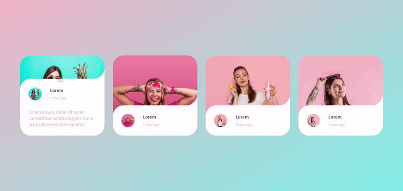
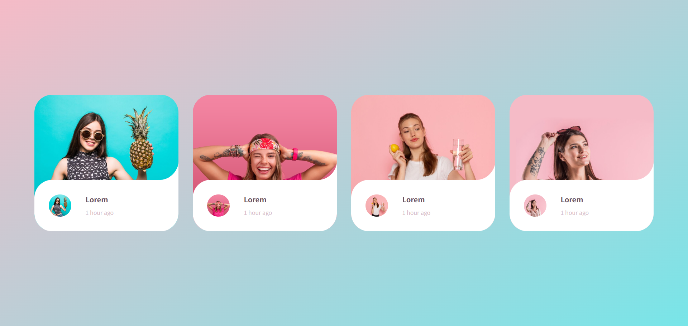
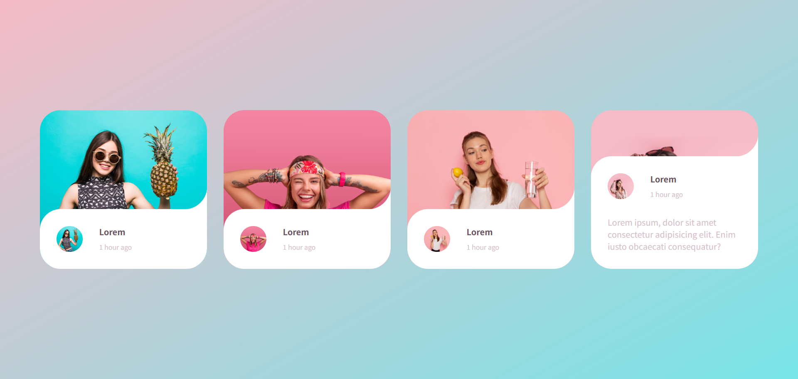
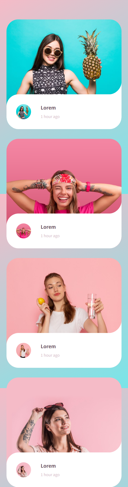

# CSS Hover Slide-Up Animation | Create Smooth Hover Effects with CSS Masking

<a href="https://www.linkedin.com/in/dharmendraverma95/" target="_blank">LinkedIn Profile </a>

<a href="https://www.behance.net/dhirukumar" target="_blank">Behance Profile </a>

This project demonstrates how to create a sleek CSS Hover Slide-Up Animation using pure CSS. By following the simple steps outlined in this guide, you'll learn how to implement smooth hover effects that add interactivity to your web elements. The animation leverages CSS masking to create inverted corner radii with minimal code, and everything is optimized using CSS variables for ease of customization.

### Features
<ul>
  <li>Pure CSS Animation</li>
  <li>Minimal Code</li>
  <li>Cross-Browser Compatibility</li>
</ul>

# Preview

 
Desktop

 

 

Mobile Design
 

 
###### Customization
<ul>
  <li>Animation Duration</li>
  <li>Transform Effect</li>
  <li>Responsive Design</li>
</ul>

###### Lang
<ul>
  <li>HTML5</li>
  <li>CSS3</li>
  <li>JavaScript</li>
</ul>

